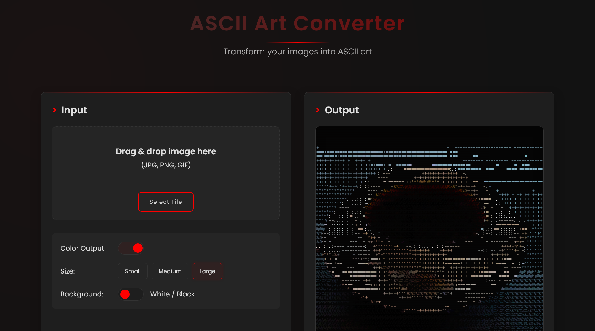

# ASCII Art Converter

A modern web application that transforms images into ASCII art with various customization options.

## Features

- **Image to ASCII Conversion**: Transform any image into ASCII art
- **Drag & Drop Interface**: Easy-to-use drag and drop functionality
- **Multiple Size Options**: Choose between small, medium, and large ASCII output
- **Color Support**: Toggle between colored and monochrome ASCII art
- **Background Options**: Switch between white and black backgrounds
- **High-Quality Export**: Save your ASCII art as high-resolution PNG images
- **Responsive Design**: Works on desktop and mobile devices

## How to Use

1. **Upload an Image**:
   - Drag and drop an image onto the drop area
   - Or click "Select File" to choose an image from your device

2. **Customize Your ASCII Art**:
   - Toggle "Color Output" to switch between colored and monochrome ASCII
   - Select size (Small, Medium, Large) to adjust the detail level
   - Toggle "Background" to switch between white and black backgrounds

3. **Save Your Creation**:
   - Click "Save as PNG" to download your ASCII art as a high-resolution image

## Technical Details

The application uses pure HTML, CSS, and JavaScript without any external libraries. It processes images by:

1. Reading the image data using the Canvas API
2. Converting each pixel to an appropriate ASCII character based on brightness
3. Applying color information when color mode is enabled
4. Rendering the result as HTML with proper styling
5. Providing high-quality PNG export functionality

## Local Development

To run this project locally:

1. Clone the repository
2. Open `test.html` in your browser
3. No build steps or dependencies required!

